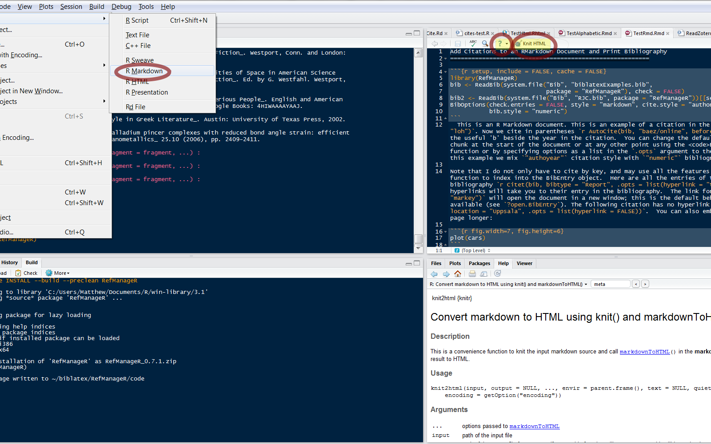

## Markup Languages

* A system for annotating a document to separate metadata from text
* E.g. `TeX`, `LaTeX`, `HTML` (HyperText Markup Language)
* Sometimes the markup is hidden from the author, e.g. `Microsoft Word` (WYSIWYG)
* Procedural markup: provides instructions for other programs to process, e.g. `TeX`
* Descriptive/semantic markup: the markup provides descriptive labels, e.g. `HTML`
* *Lightweight markup language* - markup language with simple syntax
   * Easy to write and easy to read
   * `Markdown` is a widely used example
   * Can be quickly converted to other markup languages such as `HTML`

---

## [`R Markdown`](http://www.rstudio.com/ide/docs/authoring/using_markdown)

* Provides a simple syntax for creating reproducible documents
* `R` code is executed and embedded, then report is converted to `Markdown` and `HTML`
   * Objects created in one chunk of code are available to later chunks
* In it's simplest/easiest use, any `R` script may be converted to `HTML` or `PDF`
* [`RStudio Notebooks`](https://www.rstudio.com/ide/docs/authoring/markdown_notebooks)
   * Runs `R` code in script, outputs results immediately after each line of code
   * Open any `R` script in `RStudio` and press `Ctrl+Shift+Alt+H`
* The [`stitch` and `spin`](http://yihui.name/knitr/demo/stitch/) functions in `knitr` provide additional formatting possibilties
* A quick reference document is available in `RStudio` and [here](assets/html/MarkdownQuickReference.html)
* Template is provided when `.Rmd` file started
* Mathematical notation is supported via `MathJax`; uses same markup to denote math as `TeX`
* Appearance can be customized using `CSS`

--- .img-slide

## Getting Started in `RStudio`



--- .no-highlight

## Example

```{r eval = FALSE, tidy = FALSE}
Header 1
======
### Header 2
Here is some inline R code: `r 1+1`
**This is bold** and *this is emphasized* and `this is monospace` and
[this is a link](http://example.com)
* Here
* is
  23. a
  54. nested
  1. list
```
And now a code block

\`\`\`{r}
rnorm(3)
\`\`\`

---  .smallerSpacing

## Output

Header 1
------
Header 2
======
Here is some inline R code: `r 1 + 1`
**This is bold** and *this is emphasized* and `this is monospace`
and [this is a link](http://example.com)
* Here
* is
  23. a
  54. nested
  1. list

And now a code block

```{r}
rnorm(3)
```

---

## From `Markdown` to `LaTeX`

- `Sweave` and `knitr` use a special `TeX` file with extension `.Rnw`
- A `LaTeX` document that includes `R` code
- Code chunks are started with `<< >>=` and ended with `@`
- Inline code is written `\Sexpr{ }`
- Helpful [quick reference](http://cran.r-project.org/web/packages/knitr/vignettes/knitr-refcard.pdf)
```{r knitrex, eval = FALSE}
<<chunkname, options>>=
  library(ggplot2)
  qplot(mpg, wt, data=mtcars)
@
Here is some inline code \Sexpr{1+1}
```

---

## Useful Chunk Options in `knitr`

* [_cache_](http://yihui.name/knitr/demo/cache/) \- set to `TRUE` to store long calculations
   * even the slightest change to the chunk will cause it to be recalculated
   * use `dependson='chunkname'` to specify which chunks the current chunk depends on
* _echo_ \- `FALSE` to not output the code, _or_ a numeric vector of which lines of code to hide
* _eval_ \- `FALSE` to not evaluate the chunk, or numeric vector on lines to not evaluate
8 _include_ \- `FALSE` to evaluate a chunk but not include the output
* _tidy_ \- `FALSE` to turn off formatting of code (useful if text isn't wrapping properly)
* _highlight_ \- `FALSE` to not colour code and output
* Lots of options for controlling plot output; see [here](http://yihui.name/knitr/options)
* For more customization you may need to set [hooks](http://yihui.name/knitr/hooks)

---

## Example: Automatic Generation of a Quiz

* Goal is to automatically generate a quiz from a test bank of questions
* Below are three questions written in syntax for `.Rnw` files and stored  in an `R` vector
   * `\Sexpr{...}` for inline `R` code `<<>>= ... @` for chunks

```{r eval = FALSE, tidy = FALSE}
TestBank <- c("Construct a \\emph{\\Sexpr{c('box plot', 'stem-and-left plot',
  'Normal Q-Q plot')[sample(3, 1)]}} for the following sample of data
  (\\Sexpr{paste0(round(rnorm(10, mean = 60), 1), collapse = ', ')}).",
"Construct a \\Sexpr{sample(c(90, 95, 99), 1)}\\% confidence interval for
the ratio of the variances of the following two samples
(\\Sexpr{paste0(rpois(10, 10), collapse = ', ')}) and
(\\Sexpr{paste0(rpois(6, 6), collapse = ', ')}).",
"What is the probability that an expontential random variable with $\\lambda = 1$
exceeds 1.5 given that it exceeds 1.")
```

* We can randomly choose questions from the test bank
* Here notice the first two questions will have new data each time they are generated

--- .smallerSpacing

## Example: Automatic Generation of a Quiz

* We can then write a `brew` document to generate the questions and output an `.Rnw` file
* Assuming we saved the `TestBank` vector in `TestBank.R`...
* Chunks of `R` code are delimited using `<%...>%` or `<%= ... >%` (latter outputs the results)

```{r eval = FALSE, tidy = FALSE}
\documentclass[12pt]{article}
\title{An Example Quiz using \texttt{brew} and \texttt{knitr} \\ \large IAMCS Seminar}
\author{Mathew McLean}
\usepackage{amsmath,graphicx}
\begin{document}
\maketitle
<%  source("TestBank.R")
test.length <- 2
questions <- TestBank[sample(length(TestBank), test.length)] %>
<%= for (i in seq_along(questions)){
  cat(paste0("\\textbf{Question ", i, "}\n"))
  cat(paste(questions[i], "\\vskip 5cm\n", sep = "\n"))
}  %>
\end{document}
```

---

## Example: Automatic Generation of a Quiz

Assuming we have saved the document on the previous slide as "quiz.brew"...
```{r eval = FALSE}
library(brew)
library(knitr)
brew("quiz.brew", "quiz.Rnw")
knit2pdf("quiz.Rnw", "quiz.pdf")
```

---

## Example: Automatic Generation of a Quiz

<iframe src="assets/quizEx/quiz.pdf" type='application/pdf'></iframe>

---

## Example: Automatic Generation of a Quiz

<iframe src="assets/quizEx/quiz2.pdf" type='application/pdf'></iframe>

---

## Creating `HTML5` Presentations In `R`

- [`Slidify`](http://slidify.org/) and `Rstudio` [`R Presentations`](http://www.rstudio.com/ide/docs/presentations/overview) convert `Rmd` files into `HTML5` slides
   * Rstudio's version is easier to use
   * Slidify allows for more customization, can use several different frameworks
- Slightly different syntax for both
   * For `Slidify`, slides are separated using "\-\-\-"
   * For `Rstudio R Presentations`, new slide begins with header using "====="
- Allows users to interact with your slides
   * All the powers of JavaScript are at your fingertips
- Compilation is much faster than `LaTeX/Beamer`
- Easier to type and less commands to remember
- With a little CSS and HTML knowledge becomes very easy to customize and debug
   * Customizing [RStudio output](https://www.rstudio.com/ide/docs/authoring/markdown_custom_rendering) and customizing [Slidify](http://slidify.org/customize.html)

---

## Example: Interactive Graphics from [Highcharts](http://www.highcharts.com/)

Average daily temperature for several Canadian cities (click and hover on curves and names)

See [rCharts](http://ramnathv.github.io/rCharts/), [googleVis](https://code.google.com/p/google-motion-charts-with-r/), and [ggvis](https://github.com/rstudio/ggvis) packages in `R`
<iframe src="assets/html/lineEx3.html"></iframe>

---

## More Canadian Weather Data - `googleVis`

Average daily temperature (&#8451;) and total yearly rainfall (mm.)
<table style="width: 100%; background-color: white;  table-layout: fixed;">
<tr>
<td style="width: 75%; height: 145px; background-color: white">
```{r echo = F, results = 'asis', message=FALSE, fig.align='center', fig.width=16, fig.height=10}
require(fda)
require(googleVis)
cw.dat <- data.frame(ave.temp=round(colMeans(CanadianWeather$dailyAv[,,1]), 2))
cw.dat$total.precip <- colSums(CanadianWeather$dailyAv[,, 2])
cw.dat$place <- CanadianWeather$place
lat <- c(47.560541, 44.648862, 46.136790, 43.837458, 42.753339, 45.963589, 54.800690, 48.433333, 48.345881,
         46.803283, 45.400993, 45.508670, 45.421530, 43.653226, 42.986950, 48.380895, 49.899754, 53.825527, 58.768411,
         50.454722, 53.203349,59.569326, 53.544389, 51.045325, 50.674522, 49.261226, 48.428421, 53.917064, 54.315037,
         60.721187, 64.060070,62.453972, 63.746693, 68.360744, 74.697299)
long <- c(-52.712831, -63.575320, -60.194224, -66.117382, -80.379739, -66.643115, -66.810768, -71.183333, -70.892666,
          -71.242796, -71.882429, -73.553992, -75.697193, -79.383184, -81.243177, -89.247682, -97.137494, -101.247613,
          -94.164964, -104.606667,-105.753071, -108.610521, -113.490927, -114.058101, -120.327267, -123.113927,
          -123.365644, -122.749669,-130.320819, -135.056845, -139.432035, -114.371789, -68.516967, -133.723018,
          -94.829729)
cw.dat$lat.long=sapply(1:35, function(i)paste(lat[i],long[i], sep=":"))
myGp <- gvisGeoChart(cw.dat, locationvar="lat.long", colorvar='ave.temp', hovervar='place',
                          sizevar='total.precip', options=list(region='CA', resolution='provinces'))
print(myGp, tag='chart')
```
</td>
<td style="width: 25%; background-color: white; height: 145px;">
<svg xmlns="http://www.w3.org/2000/svg"
xmlns:xlink="http://www.w3.org/1999/xlink">
  <circle cx="5" cy="10" r="5" fill="green" />
  <circle cx="20" cy="10" r="7" fill="green" />
  <circle cx="40" cy="10" r="10" fill="green" />
  <text x="60" y="15" font-size="12" font-weight="bold">    -   Yearly rainfall</text>
  <circle cx="10" cy="40" r="7" fill="lightgrey" />
  <circle cx="26" cy="40" r="7" fill="#8FBC8F" />
  <circle cx="43" cy="40" r="7" fill="green" />
  <text x="60" y="45" font-size="12" font-weight="bold">   -   Average daily temperature</text>
</svg>
</td>
</tr>
</table>
```{r eval = FALSE}
library(googleVis)
## ... omitted formatting of cw.dat data.frame
gvisGeoChart(cw.dat, locationvar="lat.long", colorvar='ave.temp', hovervar='place',
                          sizevar='total.precip', options=list(region='CA', resolution='provinces'))
```

---

## 3D plots with [`RGL`](http://cran.r-project.org/web/packages/rgl/index.html) and `WebGL`

<iframe src="assets/html/FGAMrgl.html" id="rgl"></iframe>

---

## `Shiny`

- [`Shiny`](http://www.rstudio.com/shiny/), can be used to write applications for the web in `R`
- As interacts with the app (changes inputs), `R` code is rerun to update the outputs (*reactivity*)
- As with the tools presented earlier, no knowledge of `HTML` or `Javascript` is needed
- Apps can be deployed locally using the `shiny` package or hosted on the web
- A great [tutorial](http://rstudio.github.io/shiny/tutorial/) and lots of [examples](http://www.rstudio.com/shiny/showcase/) are available on the `RStudio` website

--- .smallerSpacing

## Example: Functional Regression Modelling
(May need a moment to load)
<iframe data-src="https://fgam.shinyapps.io/fgam/" style="width: 900px; height: 600px seamless" id="shinyframe"></iframe>

---

## Version Control Systems (VCS)

* For managing changes to documents and code
* In a *distributed VCS*
   * There is no central repository
   * Each developer has their own copy of all code
   * No need to be connected to a server, other than to share with other developers

* The two most popular systems are `Git` and `Subversion` (`SVN`)
   * `Git` is a *distributed* VCS, `SVN` is not
   * `R` project uses [SVN](http://svn.r-project.org/R/branches/)
* With Git, nearly all operations are done locally and very quickly
    * Delta compression is used: only differences between versions are stored

---

## Why Use Git/GitHub (Even to Work Alone)?

* Backup of all files
* Track history of all changes to every file
* Public or private depending on preference
* Easy to transfer files between workstations (e.g. home/laptop and office PC)
* Take frequent "snapshots" ([*commits*](http://gitref.org/basic/)) of code, making it easier to find where issues started
* Have a [*branch*](http://git-scm.com/book/ch3-1.html) for working code only, one for fixing bugs, another for adding new features
   * *branching* and *merging* is so fast/easy that it can and should be done frequently
* No emailing of code to anyone, they simply checkout a copy of the repository
   * [Can give permission to make](https://help.github.com/articles/how-do-i-add-a-collaborator) (*push*) changes to a repo, or allow only a *fork*
* Users can easily report issues and suggest changes (a [*pull request*](https://help.github.com/articles/using-pull-requests)) on GitHub

---

## `GitHub`

* I personally began using the `GitHub` GUI before knowing any `Git`, finding it very easy to use
   * Learn more as projects grow in size and add collaborators
* Free public repositories
   * Private starts at $7/month for five repositories
* [GUI for Windows](http://windows.github.com) provides simple interface for many commands
* Checkout `R` packages hosted on `GitHub` using `devtools`'s `install_github` function
* Can use [Travis CI](http://travis-ci.com/) to automatically test your software
   * With each push to repo, `Travis CI` will build your project and run tests

--- .smallerSpacing

## A Sampling of Git Commands and Terminology

* *init* \- initializes a new repository
* *clone* \- create a copy of a repository
* *branch* \- an isolated working copy of the project
* *commit* \- the state of the project at a particular time (used to record changes)
* *HEAD* \- symbolic name of the currently checked out commit
* *status* \- gives information about the current working branch
* *log* \- show the commit logs
* *remote* \- manage the repositories you track (the "remotes")
* *push* \- push your changes to another repo (a complete copy must be pushed)
* *fetch* \- get files from another repository
* *pull* \- *fetch* from another repo and *merge* it with your branch
<br/>
The GUI can take care of the common tasks, but you will need to use a shell for some actions

---

## Managing Citations with `RefManageR`

* Makes it easy to print, search, update, import, combine references in `R`
* Can read in `.bib` files and read `PDF`s using `Poppler` to create a citation
* Citations can also be searched for on `Crossref`, `Google Scholar`, `Pubmed`, and `Zotero`
* Searching is very flexible, can search by arbitrary field plus key or entry type
* Citations can be generated for inclusion in `RMarkdown` and `RHTML` documents
* Bibliography of all cited references can be printed at end of document
   * hyperlinks automatically added, many bibliography and citation style available
* Supports `BibLaTeX` and `Bibtex` and converting `BibLaTeX` to `BibTeX` if forced
* Simple interface for setting default behaviour for the most used functions

---

## Printing example

```{r bib1, cache=TRUE, echo = -1}
options(width = 110)
library(RefManageR)
bib <- ReadBib(system.file("Bib", "biblatexExamples.bib", package = "RefManageR"), check = FALSE)
bib[[49:51]]
```

---

## 494 works of R.J. Carroll from Google Scholar


```{r rjc01, tidy = TRUE, cache = TRUE, echo = -1}
options(width = 100)
bib2 <- ReadBib(system.file("Bib", "RJC.bib", package = "RefManageR"))
print(bib2[2:3], .opts = list(style = "text", bib.style = "alphabetic", sorting = "none"))
```
* Authors and other "name list" fields are stored in the `person` class
```{r}
bib2[1]$author
```

---

## Extract and Update fields

* Authors and other "name list" fields are stored in the `person` class
* Let's add url and urldate fields for Jennings et al and fix the journal for Garcia et al.
```{r rjc02, tidy = FALSE, cache = TRUE, echo = -1, results = "asis"}
options(width = 100)
bib2[2:3] <- list(c(url="http://bsb.eurasipjournals.com/content/2013/1/13",
                          urldate = "2014-02-02"), c(doi="10.1093/bioinformatics/btt608",
                          journal = "Bioinformatics"))
print(bib2[2:3], .opts = list(style = "html", bib.style = "authoryear"))
```

---

## Searching with `SearchBib` and `[` Operator

* How often is someone with family name "Wang" a coauthor?
```{r rjc03, tidy = FALSE, cache = TRUE}
length(bib2[author = "wang"])
```
* How often is N. Wang a coauthor?
```{r rjc04, tidy = FALSE, cache = TRUE}
length(SearchBib(bib2, author = "Wang, N.",
                 .opts = list(match.author = "family.with.initials")))
```
* Use `names` to extract keys `bib$bibtype` to get entry types

--- .codeChange

## Searching with `SearchBib` and `[` Operator

* How often did RJC and Ruppert collaborate after leaving UNC in July, 1987?
```{r rjc05, tidy = FALSE, cache = TRUE}
length(SearchBib(bib2, author='ruppert', date="1987-07/",
   .opts = list(match.date = "exact")))
```
* Carroll and Ruppert papers NOT in the 1990's
```{r rjc06, tidy = FALSE, cache = TRUE}
length(SearchBib(bib2, author='ruppert', date = "!1990/1999"))
```
* Can specify keys using e.g. `bib2[c(key1, key2)]` or `bib2[key1,key2]`

--- .smallerSpacing

## Searching and Setting Options

* Carroll and Ruppert tech reports at UNC "OR" Carroll and Ruppert JASA papers
```{r rjc07, tidy = FALSE, cache = TRUE}
length(bib2[list(author='ruppert', bibtype="report", institution="north carolina"),
  list(author="ruppert",journal="journal of the american statistical association")])
```
* Interface for options similar to `options` function
```{r rjc08, tidy = FALSE, cache = TRUE, results = "asis"}
old.opts <- BibOptions(bib.style = "authoryear", match.author = "exact", ignore.case = FALSE,
                       first.inits = FALSE, style = "html")
bib[author = "Baez, John C."]
BibOptions(old.opts) # restore defaults
```

---

## Citations for `RMarkdown` and `RHTML` Docs

```{r echo = FALSE, cache = TRUE}
BibOptions(check.entries = FALSE)
unloadNamespace("RefManageR")
library(RefManageR)
```
* Cite functions for citations, convenience functions `Citet`, `AutoCite`, `TextCite`, `Citep`
   * Specify `style` as `"html"` or `"markdown"` for `HTML` and `Markdown` documents
   * Hyperlinks will be included automatically, and may be turned off if desired
   * The code in unevaluated, chunk form is as follows

```{r cite1, cache = TRUE, eval = FALSE}
BibOptions(check.entries = FALSE, style = "html")
Citep(bib, author = "Itzhaki", .opts = list(cite.style = "alphabetic"))
TextCite(bib, c("loh", "wilde"), .opts = list(cite.style = "authoryear", hyperlink = "#35"))
```
```{r cite2, results = "asis", cache = FALSE, include = FALSE}
BibOptions(check.entries = FALSE, style = "html")
```
* Inline (wrapped in `I()`): Here is one citation `r Citep(bib, author = "Itzhaki", .opts = list(cite.style = "alphabetic"))`, two more are `r I(TextCite(bib, c("loh", "wilde"), .opts = list(cite.style = "authoryear", hyperlink = "#36")))`
* `Itz96` goes to the `arXiv` doc, the other two references go to the bibliography slide

--- #bibSlide

## Printing the bibliography

Now we print the bibliography, using `results='asis'` in the `knitr` chunk
```{r results = "asis", dependson = c("bib1", "cite1", "cite2")}
PrintBibliography(bib, .opts = list(bib.style = "numeric"))
```
* On a single webpage, the hyperlinks in e.g. `[1]`, will go to the point of first citation
  * Getting this working automatically for `HTML5` slides is not implemented yet

--- &lastSlide

## Learning More

* See the [CRAN task view](http://cran.r-project.org/web/views/ReproducibleResearch.html) on reproducible research for other `R` packages on this topic
* [These slides](http://www.r-bloggers.com/brief-introduction-on-sweave-and-knitr-for-reproducible-research/?utm_source=twitterfeed&utm_medium=twitter&utm_campaign=Feed%3A+RBloggers+%28R+bloggers%29) for more on the basics of of `Sweave` and `knitr` and also Yihui Xie's [website](http://yihui.name/knitr/)
* CRC Press has a [several titles](http://www.crcpress.com/browse/series/crctherser) in the works and already available on the subject
   * [Dynamic Documents with R and knitr](http://www.crcpress.com/product/isbn/9781482203530) and [Reproducible Research in R and RStudio](http://www.crcpress.com/product/isbn/9781466572843)
* For `RStudio`, see all the links for various features back on [Slide 4](http://www.stat.tamu.edu/~mmclean/iamcs2/#4)
* Ramnath Vaidyanathan's [Youtube channel](http://www.youtube.com/user/ramnathv1/videos?flow=grid&view=0) for some neat demos of his packages
   * `Slidify`, `rNotebook`, `rCharts`, `rMaps`, etc. (all on [Github](https://github.com/ramnathv))
* The [Shiny tutorial](http://rstudio.github.io/shiny/tutorial/) so nice, I'm linking to it twice
* For `Git` see [here](http://git-scm.com/docs), [here](https://www.atlassian.com/git/), [here](http://gitref.org), and Pro Git [(pdf here)](https://github.s3.amazonaws.com/media/progit.en.pdf)
* [`Pandoc`](http://johnmacfarlane.net/pandoc/) - the "Swiss Army knife" for converting between markup languages
* The `RefManager` package is [available on CRAN](http://cran.r-project.org/web/packages/RefManageR/index.html)

